# Dify工作流节点化集成架构设计文档

## 项目概述

将现有的智能中医问答系统重构为Dify工作流节点，实现可视化编排的RAG流程。每个系统层次对应一个或多个Dify节点，通过工作流实现复杂的智能路由和检索增强流程。

**核心架构变化**:
- **LangChain作为链条** → **Dify工作流**: Dify工作流替代了LangChain的流程编排功能
- **应用协调层保留**: 应用协调层仍然存在，功能从"链条编排"转变为"独立FastAPI服务"
- **服务架构选择**: 采用**整体FastAPI服务**的方式，统一管理懒加载机制，为所有Dify节点提供统一的API接口
- **智能路由升级**: 采用**Qwen-Flash API + 关键词库**混合判断，提升分类准确性
- **动态配置支持**: 支持在Dify界面配置本地微调模型的提示词模板和生成参数

## 系统架构设计

### 整体工作流设计（V2.0 - 混合模式）

```mermaid
graph TB
    A[用户输入] --> B[关键词规则判断<br/>Dify直接实现]
    B --> C[Qwen-Flash模型判断<br/>Dify直接实现]
    C --> D[路由结果融合<br/>Dify直接实现]
    D --> E[加载检索组件<br/>FastAPI调用]
    E --> F[检索与知识召回<br/>FastAPI调用]
    F --> G[查询扩展与重排序<br/>FastAPI调用]
    G --> H[关键词增强<br/>Dify直接实现]
    H --> I[卸载检索组件<br/>FastAPI调用]
    I --> J[配置生成参数<br/>Dify环境变量]
    J --> K[加载生成组件<br/>FastAPI调用]
    K --> L[回答生成<br/>FastAPI调用]
    L --> M[卸载生成组件<br/>FastAPI调用]
    M --> N[输出回答<br/>Dify直接实现]
    
    O[关键词库<br/>常驻内存] -.-> B
    P[Qwen-Flash API<br/>阿里云] -.-> C
    
    style B fill:#e1f5fe
    style C fill:#e1f5fe
    style D fill:#e1f5fe
    style H fill:#e1f5fe
    style J fill:#e1f5fe
    style N fill:#e1f5fe
    style E fill:#ffecb3
    style F fill:#ffecb3
    style G fill:#ffecb3
    style I fill:#ffecb3
    style K fill:#ffecb3
    style L fill:#ffecb3
    style M fill:#ffecb3
```



**实现方式说明**:
- 🔵 **Dify直接实现**: 轻量逻辑，无需外部资源
- 🟡 **FastAPI调用**: 重度依赖组件，需要懒加载管理
- 🔴 **关键词库**: 常驻内存，从开始到结束不卸载

### 节点职责划分（V2.0）

| 节点名称 | 实现方式 | 主要功能 | 资源管理 | 输入/输出 |
|---------|---------|---------|---------|-----------|
| 关键词规则判断 | Dify直接实现 | 基于关键词库初步分类 | 关键词库常驻内存 | 查询 → 规则结果 |
| Qwen-Flash模型判断 | Dify直接实现 | 云API语义分类 | 无需本地资源 | 查询 → 模型结果 |
| 路由结果融合 | Dify直接实现 | 融合规则和模型结果 | 无需资源 | 规则+模型结果 → 最终路由 |
| 加载检索组件 | FastAPI调用 | 加载Faiss+Neo4j+小模型 | 懒加载管理 | 无 → 组件状态 |
| 检索与知识召回 | FastAPI调用 | 向量+图谱检索 | 使用已加载组件 | 查询+路由 → 文档 |
| 查询扩展与重排序 | FastAPI调用 | 文档优化 | 使用已加载组件 | 文档 → 优化文档 |
| 关键词增强 | Dify直接实现 | 实体识别和关键词提取 | 关键词库常驻内存 | 文档 → 增强文档 |
| 卸载检索组件 | FastAPI调用 | 释放检索相关资源 | 懒加载管理 | 无 → 释放状态 |
| 配置生成参数 | Dify环境变量 | 设置提示词和生成参数 | 无需资源 | 无 → 配置参数 |
| 加载生成组件 | FastAPI调用 | 加载Qwen3-1.7B+LoRA | 懒加载管理 | 无 → 组件状态 |
| 回答生成 | FastAPI调用 | 基于文档生成答案 | 使用已加载组件 | 文档+配置 → 答案 |
| 卸载生成组件 | FastAPI调用 | 释放生成模型 | 懒加载管理 | 无 → 释放状态 |
| 输出回答 | Dify直接实现 | 返回结果给用户 | 无需资源 | 答案 → 用户 |

## 详细实现方案

### 1. 智能路由节点组 (Intelligent Router Nodes)

#### 1.1 关键词规则判断节点

**实现方式**: Dify代码节点直接实现

**核心功能**:
- 基于关键词库进行快速分类
- 支持动态关键词配置
- 轻量级实现，无需外部资源

**关键词库配置**:
```python
# Dify环境变量配置
KEYWORD_RULES = {
    "hybrid_search": ["图像", "图谱", "关系", "原因", "为什么", "如何", "步骤", "过程"],
    "vector_search": ["定义", "简介", "是什么", "概述", "功效", "作用", "功能"]
}
```

**Dify代码节点实现**:
```python
def rule_based_route(query: str) -> str:
    """基于关键词规则的快速分类"""
    query_lower = query.lower()
    
    # 检查混合检索关键词
    for keyword in KEYWORD_RULES["hybrid_search"]:
        if keyword in query_lower:
            return "hybrid_search"
    
    # 检查向量检索关键词
    for keyword in KEYWORD_RULES["vector_search"]:
        if keyword in query_lower:
            return "vector_search"
    
    # 规则无法匹配
    return ""

# 执行规则判断
rule_result = rule_based_route(inputs.query)
outputs.rule_route = rule_result
```

#### 1.2 Qwen-Flash模型判断节点

**实现方式**: Dify代码节点调用云API

**API配置**:
- **API Key**: sk-6157e39178ac439bb00c43ba6b094501
- **模型名称**: qwen-flash
- **Base URL**: https://dashscope.aliyuncs.com/compatible-mode/v1
- **Dify配置**: Custom OpenAI-compatible集成

**Dify代码节点实现**:
```python
# 仅当规则无法匹配时调用模型
if inputs.rule_route == "":
    # 构建分类提示词
    prompt = f"""请将用户查询分类为以下两种类型之一：
- vector_search（适合纯文本定义、简介类查询）
- hybrid_search（适合涉及图像、关系、原因的查询）

用户查询：{inputs.query}

仅返回分类结果，无需额外说明。"""
    
    # 调用Qwen-Flash模型
    try:
        model_result = llm.invoke(prompt).strip()
        outputs.model_route = model_result
    except Exception as e:
        outputs.model_route = "vector_search"  # 默认兜底
else:
    outputs.model_route = ""  # 规则已匹配，无需模型判断
```

#### 1.3 路由结果融合节点

**实现方式**: Dify代码节点直接实现

**融合策略**: 规则优先，模型兜底

**Dify代码节点实现**:
```python
# 融合规则和模型结果
if inputs.rule_route != "":
    # 规则有结果，优先使用
    final_route = inputs.rule_route
elif inputs.model_route in ["vector_search", "hybrid_search"]:
    # 模型有有效结果
    final_route = inputs.model_route
else:
    # 默认兜底为向量检索
    final_route = "vector_search"

outputs.final_route = final_route
outputs.router_type = final_route
outputs.confidence = 0.9 if inputs.rule_route != "" else 0.8
```

### 2. 检索与知识节点组 (Retrieval & Knowledge Nodes)

#### 2.1 加载检索组件节点

**实现方式**: Dify HTTP请求节点调用FastAPI

**API端点**: `POST /api/dify/load_retrieval_components`

**Dify HTTP请求节点配置**:
```yaml
node_type: "http-request"
node_name: "加载检索组件"
config:
  url: "http://localhost:8000/api/dify/load_retrieval_components"
  method: "POST"
  body:
    components: ["faiss", "neo4j", "text2vec", "bge-reranker"]
  headers:
    Content-Type: "application/json"
  timeout: 30
```

**FastAPI接口实现**:
```python
@app.post("/api/dify/load_retrieval_components")
async def load_retrieval_components(request: LoadComponentsRequest):
    """加载检索相关组件"""
    try:
        # 并行加载所有组件
        components = await lazy_manager.load_components(
            components=request.components,
            parallel=True
        )
        return {
            "success": True,
            "loaded_components": components,
            "status": "loaded"
        }
    except Exception as e:
        return {"success": False, "error": str(e)}
```

#### 2.2 检索与知识召回节点

**实现方式**: Dify HTTP请求节点调用FastAPI

**API端点**: `POST /api/dify/retrieve_documents`

**Dify HTTP请求节点配置**:
```yaml
node_type: "http-request"
node_name: "检索与知识召回"
config:
  url: "http://localhost:8000/api/dify/retrieve_documents"
  method: "POST"
  body:
    query: "{{inputs.query}}"
    router_type: "{{inputs.final_route}}"
    config:
      enable_vector: true
      enable_graph: true
      top_k: 10
      fusion_method: "weighted"
  headers:
    Content-Type: "application/json"
  timeout: 30
```

**FastAPI接口实现**:
```python
@app.post("/api/dify/retrieve_documents")
async def retrieve_documents(request: RetrievalRequest):
    """执行文档检索"""
    try:
        # 使用已加载的组件进行检索
        documents = await retrieval_service.retrieve(
            query=request.query,
            router_type=request.router_type,
            config=request.config
        )
        return {
            "success": True,
            "documents": documents,
            "retrieval_stats": retrieval_service.get_stats()
        }
    except Exception as e:
        return {"success": False, "error": str(e)}
```

#### 2.3 查询扩展与重排序节点

**实现方式**: Dify HTTP请求节点调用FastAPI

**API端点**: `POST /api/dify/expand_and_rerank`

**Dify HTTP请求节点配置**:
```yaml
node_type: "http-request"
node_name: "查询扩展与重排序"
config:
  url: "http://localhost:8000/api/dify/expand_and_rerank"
  method: "POST"
  body:
    query: "{{inputs.query}}"
    documents: "{{inputs.documents}}"
    parallel: true
  headers:
    Content-Type: "application/json"
  timeout: 30
```

**FastAPI接口实现**:
```python
@app.post("/api/dify/expand_and_rerank")
async def expand_and_rerank(request: ExpandRerankRequest):
    """并行执行查询扩展和重排序"""
    try:
        # 并行执行扩展和重排序
        expanded_queries, reranked_docs = await asyncio.gather(
            expansion_service.expand(request.query, request.documents),
            rerank_service.rerank(request.query, request.documents)
        )
        return {
            "success": True,
            "expanded_queries": expanded_queries,
            "reranked_docs": reranked_docs
        }
    except Exception as e:
        return {"success": False, "error": str(e)}
```

#### 2.4 卸载检索组件节点

**实现方式**: Dify HTTP请求节点调用FastAPI

**API端点**: `POST /api/dify/unload_retrieval_components`

**Dify HTTP请求节点配置**:
```yaml
node_type: "http-request"
node_name: "卸载检索组件"
config:
  url: "http://localhost:8000/api/dify/unload_retrieval_components"
  method: "POST"
  body:
    components: ["faiss", "neo4j", "text2vec", "bge-reranker"]
  headers:
    Content-Type: "application/json"
  timeout: 30
```

### 3. 关键词增强节点 (Keyword Enhancement Node)

**实现方式**: Dify代码节点直接实现

**核心功能**:
- 从文档中提取中医实体和关键词
- 基于关键词库进行实体识别
- 轻量级实现，无需外部资源

**关键词库配置**:
```python
# 使用现有的实体库
ENTITY_LIBRARY_PATH = "检索与知识层/keyword/knowledge_graph_entities_only.csv"
```

**Dify代码节点实现**:
```python
import jieba
import pandas as pd
from typing import List, Dict

def load_entity_library():
    """加载实体库（在Dify中可缓存）"""
    try:
        df = pd.read_csv(ENTITY_LIBRARY_PATH, encoding='utf-8')
        entities = set(df.iloc[:, 0].dropna().astype(str).tolist())
        return entities
    except:
        return set()

def extract_entities_from_docs(documents: List[Dict], entity_library: set) -> List[Dict]:
    """从文档中提取实体"""
    enhanced_docs = []
    
    for doc in documents:
        content = doc.get('content', '')
        
        # 使用jieba分词
        words = jieba.lcut(content)
        
        # 提取实体
        entities = []
        for word in words:
            if word in entity_library and len(word) > 1:
                entities.append(word)
        
        # 去重
        entities = list(set(entities))
        
        # 增强文档
        enhanced_doc = {
            **doc,
            'entities': entities,
            'entity_count': len(entities),
            'enhanced_content': f"{content}\n[实体: {', '.join(entities)}]"
        }
        enhanced_docs.append(enhanced_doc)
    
    return enhanced_docs

# 加载实体库（全局缓存）
if 'entity_library' not in globals():
    entity_library = load_entity_library()

# 处理文档
enhanced_documents = extract_entities_from_docs(
    inputs.documents, 
    entity_library
)

# 提取所有实体
all_entities = []
for doc in enhanced_documents:
    all_entities.extend(doc['entities'])

outputs.enhanced_documents = enhanced_documents
outputs.entities = list(set(all_entities))
outputs.entity_count = len(set(all_entities))
```

### 4. 生成节点组 (Generation Nodes)

#### 4.1 配置生成参数节点

**实现方式**: Dify环境变量 + 代码节点

**Dify环境变量配置**:
```bash
# 提示词模板
GENERATION_PROMPT_TEMPLATE="基于以下文档，用简洁准确的语言回答问题（参考文档中的关键信息，不要编造）。\n文档：{docs}\n问题：{query}\n回答："

# 生成参数
TEMPERATURE=0.6
MAX_TOKENS=800
TOP_P=0.9
```

**Dify代码节点实现**:
```python
# 从环境变量获取提示词模板
prompt_template = env.GENERATION_PROMPT_TEMPLATE

# 构建完整提示词
docs_content = "\n".join([doc.get('content', '') for doc in inputs.enhanced_documents])
full_prompt = prompt_template.format(
    docs=docs_content,
    query=inputs.query
)

# 准备生成参数
generation_params = {
    "temperature": float(env.TEMPERATURE),
    "max_tokens": int(env.MAX_TOKENS),
    "top_p": float(env.TOP_P)
}

# 动态调整参数（可选）
if len(inputs.enhanced_documents) > 5:
    generation_params["max_tokens"] = 1200

outputs.full_prompt = full_prompt
outputs.generation_params = generation_params
```

#### 4.2 加载生成组件节点

**实现方式**: Dify HTTP请求节点调用FastAPI

**API端点**: `POST /api/dify/load_generation_component`

**Dify HTTP请求节点配置**:
```yaml
node_type: "http-request"
node_name: "加载生成组件"
config:
  url: "http://localhost:8000/api/dify/load_generation_component"
  method: "POST"
  body:
    component: "qwen3-1.7b-finetuned"
    config:
      base_model_path: "Model Layer/model/qwen/Qwen3-1.7B"
      adapter_path: "Model Layer/model/checkpoint-7983"
      lora_enabled: true
  headers:
    Content-Type: "application/json"
  timeout: 60
```

#### 4.3 回答生成节点

**实现方式**: Dify HTTP请求节点调用FastAPI

**API端点**: `POST /api/dify/generate_answer`

**Dify HTTP请求节点配置**:
```yaml
node_type: "http-request"
node_name: "回答生成"
config:
  url: "http://localhost:8000/api/dify/generate_answer"
  method: "POST"
  body:
    full_prompt: "{{inputs.full_prompt}}"
    generation_params: "{{inputs.generation_params}}"
  headers:
    Content-Type: "application/json"
  timeout: 120
```

**FastAPI接口实现**:
```python
@app.post("/api/dify/generate_answer")
async def generate_answer(request: GenerateAnswerRequest):
    """基于Dify配置的参数生成答案"""
    try:
        # 使用已加载的生成组件
        answer = await generation_service.generate(
            prompt=request.full_prompt,
            params=request.generation_params
        )
        return {
            "success": True,
            "answer": answer,
            "generation_stats": generation_service.get_stats()
        }
    except Exception as e:
        return {"success": False, "error": str(e)}
```

#### 4.4 卸载生成组件节点

**实现方式**: Dify HTTP请求节点调用FastAPI

**API端点**: `POST /api/dify/unload_generation_component`

**Dify HTTP请求节点配置**:
```yaml
node_type: "http-request"
node_name: "卸载生成组件"
config:
  url: "http://localhost:8000/api/dify/unload_generation_component"
  method: "POST"
  body:
    component: "qwen3-1.7b-finetuned"
  headers:
    Content-Type: "application/json"
  timeout: 30
```

### 5. 输出节点 (Output Node)

**实现方式**: Dify直接实现

**核心功能**:
- 格式化最终答案
- 添加元数据信息
- 返回给用户

**Dify代码节点实现**:
```python
# 格式化最终输出
final_output = {
    "answer": inputs.answer,
    "query": inputs.query,
    "entities": inputs.entities,
    "entity_count": inputs.entity_count,
    "generation_params": inputs.generation_params,
    "timestamp": datetime.now().isoformat(),
    "workflow_version": "v2.0"
}

# 输出最终结果
outputs.final_answer = final_output["answer"]
outputs.metadata = final_output
```

### 6. 模型生成节点 (Model Generation Node)

**API端点**: `POST /api/dify/nodes/generation`

**功能**:
- 基于增强文档生成答案
- 支持多种生成模式
- 自适应生成参数
- **懒加载机制**: 加载Qwen3-1.7B模型，完成后保持加载状态直到下次智能路由

**请求格式**:
```json
{
  "query": "人参和黄芪的配伍关系",
  "enhanced_docs": [...],
  "generation_config": {
    "temperature": 0.7,
    "max_tokens": 512,
    "mode": "hybrid"
  },
  "model_config": {
    "keep_loaded": true,
    "unload_on_next_router": true
  }
}
```

**响应格式**:
```json
{
  "success": true,
  "answer": "人参和黄芪是经典的中药配伍...",
  "generation_stats": {
    "tokens_generated": 256,
    "generation_time": 1.2,
    "mode_used": "hybrid"
  },
  "model_status": "loaded",
  "execution_time": 3.5
}
```

### 7. 流式输出节点 (Streaming Output Node)

**API端点**: `POST /api/dify/nodes/stream`

**功能**:
- 将生成结果转换为流式输出
- 支持SSE格式
- 实时token推送
- **无需额外模型**: 使用已加载的生成模型

**请求格式**:
```json
{
  "answer": "人参和黄芪是经典的中药配伍...",
  "stream_config": {
    "chunk_size": 10,
    "delay_ms": 50
  }
}
```

**响应格式** (SSE):
```
data: {"token": "人参", "position": 0}

data: {"token": "和", "position": 1}

data: [DONE]
```

### 8. 多模态节点 (Multimodal Node) - 预留

**API端点**: `POST /api/dify/nodes/multimodal`

**功能**:
- 图像分析（舌诊、脉象）
- OCR文字识别
- 多模态内容融合
- **懒加载机制**: 加载视觉模型进行分析，完成后立即卸载

**请求格式**:
```json
{
  "query": "这是什么舌象",
  "image_base64": "data:image/jpeg;base64,...",
  "analysis_type": "tongue_diagnosis",
  "model_config": {
    "vision_model": "clip-vit-base",
    "auto_unload": true,
    "unload_delay": 0
  }
}
```

**响应格式**:
```json
{
  "success": true,
  "analysis_result": {
    "tongue_color": "淡红",
    "tongue_coating": "薄白",
    "diagnosis": "正常舌象"
  },
  "confidence": 0.88,
  "enhanced_query": "淡红舌薄白苔正常舌象",
  "model_status": "unloaded",
  "execution_time": 2.8
}
```

## 技术实现细节

### 1. 节点间数据传递

**标准数据格式**:
```python
class NodeData(BaseModel):
    node_id: str
    node_type: str
    input_data: Dict[str, Any]
    output_data: Dict[str, Any]
    metadata: Dict[str, Any]
    timestamp: datetime
    request_id: str
```

### 2. 错误处理机制

**统一错误格式**:
```json
{
  "success": false,
  "error_code": "NODE_EXECUTION_ERROR",
  "message": "节点执行失败",
  "details": {
    "node_id": "router",
    "error_type": "MODEL_LOAD_ERROR",
    "suggestion": "请检查模型文件路径"
  },
  "request_id": "uuid-xxx",
  "timestamp": 1234567890
}
```

### 3. 懒加载机制实现（V2.0）

**核心策略**:
- **关键词库**: 常驻内存，从开始到结束不卸载
- **检索组件**: 并行加载Faiss+Neo4j+小模型，检索完成后立即卸载
- **生成组件**: 懒加载Qwen3-1.7B+LoRA，生成完成后立即卸载
- **云API**: Qwen-Flash无需本地资源，直接调用

**统一懒加载管理器**:
```python
class UnifiedLazyManager:
    """统一懒加载管理器 - V2.0"""
    
    def __init__(self):
        self.loaded_components = {}
        self.component_configs = {
            "faiss": {"path": "检索与知识层/faiss_rag", "memory_usage": "medium"},
            "neo4j": {"path": "检索与知识层/Graphrag", "memory_usage": "medium"},
            "text2vec": {"path": "Model Layer/model/text2vec-base-chinese-paraphrase", "memory_usage": "low"},
            "bge-reranker": {"path": "Model Layer/model/bge-reranker-base", "memory_usage": "low"},
            "qwen3-1.7b-finetuned": {
                "base_model_path": "Model Layer/model/qwen/Qwen3-1.7B",
                "adapter_path": "Model Layer/model/checkpoint-7983",
                "lora_enabled": True,
                "memory_usage": "high"
            }
        }
    
    async def load_components(self, components: list, parallel: bool = True):
        """加载组件"""
        if parallel:
            tasks = [self._load_single_component(comp) for comp in components]
            results = await asyncio.gather(*tasks)
            return dict(zip(components, results))
        else:
            results = {}
            for comp in components:
                results[comp] = await self._load_single_component(comp)
            return results
    
    async def unload_components(self, components: list):
        """卸载组件"""
        for comp in components:
            if comp in self.loaded_components:
                del self.loaded_components[comp]
        
        # 强制垃圾回收
        gc.collect()
        torch.cuda.empty_cache()
        logger.info(f"组件 {components} 已卸载")
```

**节点执行流程**:
```python
class NodeExecutor:
    def __init__(self):
        self.model_manager = LazyModelManager()
    
    async def execute_router_node(self, request):
        """智能路由节点执行"""
        # 1. 加载完整微调模型（基础模型 + LoRA参数）
        model = await self.model_manager.load_model(
            "qwen3-1.7b-finetuned", 
            {
                "base_model_path": "Model Layer/model/qwen/Qwen3-1.7B",
                "adapter_path": "Model Layer/model/checkpoint-7983",
                "lora_enabled": True
            }
        )
        
        # 2. 执行智能路由分类（混合策略）
        # 2.1 复杂推理判断（Qwen模型）
        is_complex = await model.is_complex_reasoning(request.query)
        if is_complex:
            result = RouteType.COMPLEX_REASONING, 0.9
        
        # 2.2 功效查询判断（Qwen模型）
        elif await model.is_effect_query(request.query):
            result = RouteType.SEMANTIC_VAGUE, 0.9
        
        # 2.3 实体识别（实体库匹配）
        elif len(self._extract_entities_from_library(request.query)) >= 1:
            entities = self._extract_entities_from_library(request.query)
            confidence = 0.8 + min(len(entities) * 0.03, 0.15)
            result = RouteType.ENTITY_DRIVEN, confidence
        
        # 2.4 关键词规则（推荐查询等）
        elif self._is_recommendation_query(request.query):
            result = RouteType.ENTITY_DRIVEN, 0.9
        
        # 默认：语义模糊型
        else:
            result = RouteType.SEMANTIC_VAGUE, 0.8
        
        # 3. 立即卸载模型
        await self.model_manager.unload_model("qwen3-1.7b-finetuned", delay=0)
        
        return result
    
    async def execute_retrieval_node(self, request):
        """检索与知识节点执行"""
        # 1. 并行加载Faiss和Neo4j数据库
        databases = await self.model_manager.load_databases(
            request.database_config["faiss_path"],
            request.database_config["neo4j_path"]
        )
        
        # 2. 执行并行检索
        vector_results = await databases["faiss"].search(request.query, top_k=request.config["top_k"])
        graph_results = await databases["neo4j"].search(request.query, top_k=request.config["top_k"])
        
        # 3. 融合结果
        fused_results = self._fuse_results(vector_results, graph_results, request.config["fusion_method"])
        
        # 4. 立即卸载数据库
        db_key = f"{request.database_config['faiss_path']}_{request.database_config['neo4j_path']}"
        await self.model_manager.unload_databases(db_key, delay=0)
        
        return fused_results
    
    async def execute_generation_node(self, request):
        """模型生成节点执行"""
        # 1. 加载完整微调模型（基础模型 + LoRA参数）
        model = await self.model_manager.load_model(
            "qwen3-1.7b-finetuned",
            {
                "base_model_path": "Model Layer/model/qwen/Qwen3-1.7B", 
                "adapter_path": "Model Layer/model/checkpoint-7983",
                "lora_enabled": True
            }
        )
        
        # 2. 执行生成
        result = await model.generate_answer(request.enhanced_docs)
        
        # 3. 保持模型加载状态
        # 不调用unload_model，等待下次智能路由时卸载
        
        return result
```

**显存优化策略**:
- **智能路由**: 加载完整微调模型（基础+LoRA），执行混合策略分类后立即卸载，释放显存
- **检索与知识**: 并行加载Faiss向量数据库和Neo4j知识图谱，检索完成后立即卸载
- **查询扩展/重排序**: 使用小模型（text2vec-paraphrase + bge-reranker），可并行加载，执行后同时卸载
- **模型生成**: 加载完整微调模型（基础+LoRA），保持加载状态，避免重复加载开销
- **下次智能路由**: 卸载生成模型，加载路由模型
- **并行优化**: 查询扩展和重排序节点可同时加载两个小模型（总显存约800MB）
- **LoRA优势**: LoRA参数很小（约100MB），加载速度快，显存占用少
- **数据库优化**: Faiss和Neo4j按需加载，避免常驻内存占用
- **混合策略**: Qwen模型推理 + 实体库匹配 + 关键词规则，提高分类准确性

## Dify工作流配置（V2.0）

### 1. 工作流设计（混合模式）

在Dify中创建工作流，按以下顺序连接节点：

```
开始 → 关键词规则判断[Dify直接实现] → Qwen-Flash模型判断[Dify直接实现] → 路由结果融合[Dify直接实现]
                    ↓
加载检索组件[FastAPI调用] → 检索与知识召回[FastAPI调用] → 查询扩展与重排序[FastAPI调用] → 关键词增强[Dify直接实现]
                    ↓
卸载检索组件[FastAPI调用] → 配置生成参数[Dify环境变量] → 加载生成组件[FastAPI调用] → 回答生成[FastAPI调用]
                    ↓
卸载生成组件[FastAPI调用] → 输出回答[Dify直接实现] → 结束
```

**实现方式说明**:
- 🔵 **Dify直接实现**: 轻量逻辑，无需外部资源
- 🟡 **FastAPI调用**: 重度依赖组件，需要懒加载管理
- 🔴 **关键词库**: 常驻内存，从开始到结束不卸载

**资源管理策略**:
- 🔴 **关键词库**: 常驻内存，从开始到结束不卸载
- 🔴 **Qwen-Flash API**: 云服务，无需本地资源
- 🔴 **检索组件**: 并行加载Faiss+Neo4j+小模型，检索完成后立即卸载
- 🔴 **生成组件**: 懒加载Qwen3-1.7B+LoRA，生成完成后立即卸载
- 🔴 **动态配置**: 支持在Dify界面调整提示词模板和生成参数

### 2. 节点配置参数（V2.0）

**关键词规则判断节点**:
- 实现方式: Dify代码节点
- 关键词库: 环境变量配置
- 规则类型: 混合检索/向量检索关键词
- 超时时间: 1秒

**Qwen-Flash模型判断节点**:
- 实现方式: Dify代码节点调用云API
- API Key: sk-6157e39178ac439bb00c43ba6b094501
- 模型名称: qwen-flash
- Base URL: https://dashscope.aliyuncs.com/compatible-mode/v1
- 超时时间: 10秒

**路由结果融合节点**:
- 实现方式: Dify代码节点
- 融合策略: 规则优先，模型兜底
- 超时时间: 1秒

**加载检索组件节点**:
- 实现方式: Dify HTTP请求节点
- API端点: `POST /api/dify/load_retrieval_components`
- 组件: ["faiss", "neo4j", "text2vec", "bge-reranker"]
- 超时时间: 30秒

**检索与知识召回节点**:
- 实现方式: Dify HTTP请求节点
- API端点: `POST /api/dify/retrieve_documents`
- 配置: 向量+图谱检索，融合权重0.5:0.5
- 超时时间: 30秒

**查询扩展与重排序节点**:
- 实现方式: Dify HTTP请求节点
- API端点: `POST /api/dify/expand_and_rerank`
- 并行处理: 查询扩展和重排序同时执行
- 超时时间: 30秒

**关键词增强节点**:
- 实现方式: Dify代码节点
- 实体库: `检索与知识层/keyword/knowledge_graph_entities_only.csv`
- 分词工具: jieba
- 超时时间: 5秒

**配置生成参数节点**:
- 实现方式: Dify环境变量 + 代码节点
- 提示词模板: 环境变量配置
- 生成参数: temperature, max_tokens, top_p
- 超时时间: 1秒

**加载生成组件节点**:
- 实现方式: Dify HTTP请求节点
- API端点: `POST /api/dify/load_generation_component`
- 组件: qwen3-1.7b-finetuned
- 超时时间: 60秒

**回答生成节点**:
- 实现方式: Dify HTTP请求节点
- API端点: `POST /api/dify/generate_answer`
- 参数: 动态配置的提示词和生成参数
- 超时时间: 120秒

**卸载生成组件节点**:
- 实现方式: Dify HTTP请求节点
- API端点: `POST /api/dify/unload_generation_component`
- 超时时间: 30秒

### 3. 环境变量配置（V2.0）

**Dify环境变量**:
```bash
# 关键词规则配置
KEYWORD_RULES_HYBRID=["图像", "图谱", "关系", "原因", "为什么", "如何", "步骤", "过程"]
KEYWORD_RULES_VECTOR=["定义", "简介", "是什么", "概述", "功效", "作用", "功能"]

# 提示词模板配置
GENERATION_PROMPT_TEMPLATE="基于以下文档，用简洁准确的语言回答问题（参考文档中的关键信息，不要编造）。\n文档：{docs}\n问题：{query}\n回答："

# 生成参数配置
TEMPERATURE=0.6
MAX_TOKENS=800
TOP_P=0.9

# 实体库路径
ENTITY_LIBRARY_PATH=检索与知识层/keyword/knowledge_graph_entities_only.csv
```

**FastAPI环境变量**:
```bash
# 模型配置
MODEL_BASE_PATH=Model Layer/model/qwen/Qwen3-1.7B
MODEL_ADAPTER_PATH=Model Layer/model/checkpoint-7983
TEXT2VEC_MODEL_PATH=Model Layer/model/text2vec-base-chinese-paraphrase
BGE_RERANKER_PATH=Model Layer/model/bge-reranker-base

# 数据库配置
FAISS_DB_PATH=检索与知识层/faiss_rag
NEO4J_DB_PATH=检索与知识层/Graphrag

# 懒加载配置
LAZY_LOADING_ENABLED=true
AUTO_UNLOAD_DELAY=0
GPU_MEMORY_FRACTION=0.8
FORCE_GC_ON_UNLOAD=true

# 并行加载配置
PARALLEL_SMALL_MODELS=true
PARALLEL_DATABASES=true

# LoRA配置
LORA_ENABLED=true
LORA_RANK=16
LORA_ALPHA=32

# 数据库连接配置
NEO4J_URI=bolt://localhost:7687
NEO4J_USERNAME=neo4j
NEO4J_PASSWORD=your_password

# API配置
API_HOST=0.0.0.0
API_PORT=8000
LOG_LEVEL=INFO

# 显存管理
GPU_MEMORY_FRACTION=0.8
FORCE_GC_ON_UNLOAD=true
SMALL_MODEL_MEMORY_LIMIT=1000  # 小模型内存限制（MB）
DATABASE_MEMORY_LIMIT=2000     # 数据库内存限制（MB）
```

## 实施计划

### 阶段一：核心节点开发（1-2周）

1. **智能路由节点**
   - 文件: `应用协调层/middle/api/nodes/router_node.py`
   - 功能: 查询分类、路由决策

2. **检索与知识节点**
   - 文件: `应用协调层/middle/api/nodes/retrieval_node.py`
   - 功能: 向量+图谱检索

3. **模型生成节点**
   - 文件: `应用协调层/middle/api/nodes/generation_node.py`
   - 功能: 答案生成

### 阶段二：增强节点开发（1周）

1. **查询扩展节点**
   - 文件: `应用协调层/middle/api/nodes/expansion_node.py`

2. **重排序节点**
   - 文件: `应用协调层/middle/api/nodes/rerank_node.py`

3. **关键词增强节点**
   - 文件: `应用协调层/middle/api/nodes/enhancement_node.py`

### 阶段三：流式输出和集成（1周）

1. **流式输出节点**
   - 文件: `应用协调层/middle/api/nodes/stream_node.py`

2. **Dify工作流集成**
   - 文件: `文档层/docs/DIFY_WORKFLOW_SETUP.md`

3. **测试和优化**
   - 文件: `测试与质量保障层/tests/test_dify_nodes.py`

### 阶段四：多模态预留（1周）

1. **多模态节点框架**
   - 文件: `应用协调层/middle/api/nodes/multimodal_node.py`

2. **接口预留**
   - 图像分析接口
   - OCR识别接口

## 关键文件清单

### 新建文件

**节点实现**:
- `应用协调层/middle/api/nodes/router_node.py`
- `应用协调层/middle/api/nodes/retrieval_node.py`
- `应用协调层/middle/api/nodes/expansion_node.py`
- `应用协调层/middle/api/nodes/rerank_node.py`
- `应用协调层/middle/api/nodes/enhancement_node.py`
- `应用协调层/middle/api/nodes/generation_node.py`
- `应用协调层/middle/api/nodes/stream_node.py`
- `应用协调层/middle/api/nodes/multimodal_node.py`

**数据模型**:
- `应用协调层/middle/api/node_schemas.py`

**工具函数**:
- `应用协调层/middle/utils/node_utils.py`
- `应用协调层/middle/utils/stream_utils.py`

**文档**:
- `文档层/docs/DIFY_WORKFLOW_SETUP.md`
- `文档层/docs/NODE_API_REFERENCE.md`

**测试**:
- `测试与质量保障层/tests/test_dify_nodes.py`

### 修改文件

**主应用**:
- `应用协调层/middle/api/main_app.py` - 注册节点路由

**服务层**:
- `应用协调层/middle/services/rag_chain.py` - 支持节点化调用
- `应用协调层/middle/services/model_service.py` - 流式生成支持

## 预期效果（V2.0）

### 核心优势
1. **混合模式架构**: Dify直接实现 + FastAPI转发，兼顾轻量逻辑和重度依赖组件
2. **智能路由升级**: 关键词规则 + Qwen-Flash API混合判断，提升分类准确性
3. **动态配置支持**: 支持在Dify界面调整提示词模板和生成参数，无需修改代码
4. **显存优化**: 懒加载机制，最大显存使用量约5.3GB，相比全量加载减少70%
5. **性能提升**: 并行执行、云API调用、资源管理优化
6. **易于扩展**: 预留多模态接口，支持未来功能扩展
7. **生产就绪**: 完整的错误处理、日志记录、监控指标

### 技术优势
- **显存优化**: 关键词库常驻内存，检索组件按需加载，生成组件懒加载
- **低配置友好**: 最大显存使用约5.3GB，适合中等配置设备
- **资源高效**: 云API + 本地模型混合，成本效益最优
- **LoRA优势**: 微调参数小，加载速度快，显存占用少
- **数据库优化**: Faiss和Neo4j按需加载，避免常驻内存占用
- **混合策略**: 关键词规则 + 云API + 本地模型，提高分类准确性
8. **低配置友好**: 适配8GB显存配置，避免OOM错误

## 技术优势

1. **降低复杂度**: 将复杂的RAG流程拆分为可管理的节点
2. **提高可维护性**: 每个节点职责单一，便于调试和优化
3. **增强灵活性**: 支持A/B测试不同的节点组合
4. **便于监控**: 每个节点独立的性能指标和错误追踪
5. **支持扩展**: 预留接口支持未来功能增强
6. **显存友好**: 懒加载机制适配低配置环境
7. **资源高效**: 按需加载模型，避免资源浪费

## 总结

通过将智能中医问答系统重构为Dify工作流节点，我们实现了：

- **模块化设计**: 每个系统层次对应专门的节点
- **可视化编排**: 通过Dify工作流实现复杂的RAG流程
- **灵活配置**: 支持动态调整和优化
- **生产就绪**: 完整的错误处理和监控体系
- **未来扩展**: 预留多模态和高级功能接口
- **显存优化**: 懒加载机制适配低配置环境
- **资源高效**: 按需加载模型，避免资源浪费

**懒加载机制核心优势**:
- 🔴 **智能路由**: 加载完整微调模型（基础+LoRA），执行混合策略分类后立即卸载，释放显存
- 🔴 **检索与知识**: 并行加载Faiss向量数据库和Neo4j知识图谱，检索完成后立即卸载
- 🔴 **查询扩展/重排序**: 使用小模型（text2vec-paraphrase + bge-reranker），可并行加载，执行后同时卸载
- 🔴 **模型生成**: 加载完整微调模型（基础+LoRA），保持加载状态，避免重复加载开销
- 🔄 **循环优化**: 下次智能路由时卸载生成模型，加载路由模型
- ⚡ **并行优化**: 两个小模型可同时加载，总显存使用约800MB，比BERT模型节省30%
- 🚀 **LoRA优势**: LoRA参数小（约100MB），加载速度快，显存占用少
- 💾 **数据库优化**: Faiss和Neo4j按需加载，避免常驻内存占用
- 🧠 **混合策略**: Qwen模型推理 + 实体库匹配 + 关键词规则，提高分类准确性

这种架构既保持了现有系统的技术优势，又提供了更好的可维护性和扩展性，特别适合低配置环境的毕业设计展示和后续研究开发。

## 模块功能对照表

### 完整模块结构说明

本节详细列出每个模块的结构和功能，方便对照Dify开发文档进行设置。

---

### 1. 智能路由节点 (Intelligent Router Node)

#### 📍 API端点
```
POST /api/dify/nodes/router
```

#### 📦 模块结构
```
应用协调层/
├── middle/utils/
│   └── intelligent_router.py    # 智能路由分类器实现
│       ├── RouteType (Enum)     # 路由类型枚举
│       ├── IntelligentRouter    # 智能路由主类
│       ├── _load_entity_keywords()  # 加载实体库
│       ├── classify()           # 查询分类方法
│       ├── _extract_entities()  # 实体提取
│       ├── _is_complex_reasoning()  # 复杂推理判断
│       └── _is_effect_query()      # 功效查询判断
└── services/
    └── intelligent_router_service.py  # 服务层封装
        └── IntelligentRouterService
```

#### 🔧 核心功能
- **查询分类**: 将用户查询分为三种类型
  - `ENTITY_DRIVEN`: 实体主导型（向量检索）
  - `SEMANTIC_VAGUE`: 语义模糊型（知识图谱检索）
  - `COMPLEX_REASONING`: 复杂推理型（混合检索）
- **混合策略**:
  1. Qwen模型判断：复杂推理、功效查询
  2. 实体库匹配：从CSV提取有效实体
  3. 关键词规则：推荐查询等特殊规则
- **懒加载管理**: 加载Qwen3-1.7B+LoRA，完成后立即卸载

#### 📝 Dify节点配置
```yaml
node_type: "code"
node_name: "智能路由节点"
code: |
  # 调用FastAPI接口
  import requests
  response = requests.post(
    "http://localhost:8000/api/dify/nodes/router",
    json={
      "query": inputs.query,
      "model_config": {
        "base_model_path": "Model Layer/model/qwen/Qwen3-1.7B",
        "adapter_path": "Model Layer/model/checkpoint-7983",
        "lora_enabled": True,
        "auto_unload": True
      }
    }
  )
  return response.json()

outputs:
  router_type: "{{result.router_type}}"
  confidence: "{{result.confidence}}"
  entities: "{{result.entities}}"
```

---

### 2. 检索与知识节点 (Retrieval & Knowledge Node)

#### 📍 API端点
```
POST /api/dify/nodes/retrieval
```

#### 📦 模块结构
```
检索与知识层/
├── faiss_rag/                 # Faiss向量检索
│   ├── vector_retrieval_system/
│   │   ├── chroma_manager.py  # ChromaDB管理
│   │   ├── faiss_manager.py   # Faiss管理
│   │   └── vector_retrieval.py  # 向量检索实现
│   └── 向量数据库_简单查询/   # 数据库路径
└── Graphrag/                  # Neo4j知识图谱
    ├── src/
    │   └── graphrag_processor.py  # 图谱检索实现
    └── neo4j_config.py        # Neo4j配置

应用协调层/
├── middle/adapters/
│   ├── simple_vector_adapter.py  # 向量检索适配器
│   └── graph_adapter.py       # 知识图谱适配器
└── middle/core/
    └── hybrid_retrieval_coordinator.py  # 混合检索协调器
```

#### 🔧 核心功能
- **向量检索**: 
  - 模型：iic/nlp_gte_sentence-embedding_chinese-small
  - 数据库：ChromaDB + Faiss
  - 返回：top_k个最相似文档
- **知识图谱检索**:
  - 数据库：Neo4j（神农中医知识图谱）
  - 节点数：217K
  - 关系数：1.6M
  - 最大深度：3
- **结果融合**:
  - 方法：加权融合（weighted）
  - 权重：默认0.5/0.5，根据路由类型调整
- **懒加载管理**: 并行加载Faiss和Neo4j，完成后立即卸载

#### 📝 Dify节点配置
```yaml
node_type: "code"
node_name: "检索与知识节点"
code: |
  import requests
  response = requests.post(
    "http://localhost:8000/api/dify/nodes/retrieval",
    json={
      "query": inputs.query,
      "router_info": inputs.router_info,
      "config": {
        "enable_vector": True,
        "enable_graph": True,
        "top_k": 10,
        "fusion_method": "weighted"
      },
      "database_config": {
        "faiss_path": "检索与知识层/faiss_rag",
        "neo4j_path": "检索与知识层/Graphrag",
        "auto_unload": True
      }
    }
  )
  return response.json()

outputs:
  documents: "{{result.documents}}"
  retrieval_stats: "{{result.retrieval_stats}}"
```

---

### 3. 查询扩展节点 (Query Expansion Node)

#### 📍 API端点
```
POST /api/dify/nodes/query_expansion
```

#### 📦 模块结构
```
应用协调层/
├── middle/utils/
│   └── local_enhancer.py    # 查询扩展和重排序
│       ├── LocalQueryExpander    # 查询扩展器
│       ├── _load_model()         # 加载text2vec模型
│       └── expand_query()        # 扩展查询
└── services/
    └── expansion_service.py  # 服务层封装
```

#### 🔧 核心功能
- **模型**: text2vec-base-chinese-paraphrase (400MB)
- **扩展策略**:
  - 语义相似度计算
  - 同义词生成
  - 相关概念扩展
- **懒加载管理**: 加载text2vec模型，完成后立即卸载
- **并行优化**: 可与重排序节点并行加载

#### 📝 Dify节点配置
```yaml
node_type: "code"
node_name: "查询扩展节点"
code: |
  import requests
  response = requests.post(
    "http://localhost:8000/api/dify/nodes/query_expansion",
    json={
      "original_query": inputs.query,
      "retrieved_docs": inputs.documents,
      "model_config": {
        "model_name": "text2vec-base-chinese-paraphrase",
        "auto_unload": True
      }
    }
  )
  return response.json()

outputs:
  expanded_queries: "{{result.expanded_queries}}"
```

---

### 4. 重排序节点 (Re-ranking Node)

#### 📍 API端点
```
POST /api/dify/nodes/rerank
```

#### 📦 模块结构
```
应用协调层/
├── middle/utils/
│   └── local_enhancer.py
│       ├── LocalReranker      # 重排序器
│       ├── _load_model()      # 加载bge-reranker
│       └── rerank()           # 重排序
└── services/
    └── rerank_service.py
```

#### 🔧 核心功能
- **模型**: bge-reranker-base (400MB)
- **排序策略**: 
  - Cross-encoder架构
  - Query-document相关性评分
  - Sigmoid归一化（0-1）
- **懒加载管理**: 加载bge-reranker，完成后立即卸载
- **并行优化**: 可与查询扩展节点并行加载

#### 📝 Dify节点配置
```yaml
node_type: "code"
node_name: "重排序节点"
code: |
  import requests
  response = requests.post(
    "http://localhost:8000/api/dify/nodes/rerank",
    json={
      "query": inputs.query,
      "documents": inputs.documents,
      "model_config": {
        "model_name": "bge-reranker-base",
        "auto_unload": True
      }
    }
  )
  return response.json()

outputs:
  reranked_docs: "{{result.reranked_docs}}"
  scores: "{{result.scores}}"
```

---

### 5. 关键词增强节点 (Keyword Enhancement Node)

#### 📍 API端点
```
POST /api/dify/nodes/keyword_enhance
```

#### 📦 模块结构
```
检索与知识层/
└── keyword/
    └── knowledge_graph_entities_only.csv  # 实体库（46,697条）

应用协调层/
├── middle/utils/
│   └── entity_extractor.py  # 实体提取器
│       ├── load_entity_library()  # 加载实体库
│       ├── extract_entities()     # 提取实体
│       └── enhance_documents()    # 增强文档
└── services/
    └── keyword_enhance_service.py
```

#### 🔧 核心功能
- **实体识别**: 从文档中提取中医实体（药材、病症等）
- **关键词提取**: 提取重要关键词用于增强检索
- **文档增强**: 为文档添加实体标签和关键词
- **无需模型**: 基于CSV实体库，轻量级实现

#### 📝 Dify节点配置
```yaml
node_type: "code"
node_name: "关键词增强节点"
code: |
  import requests
  response = requests.post(
    "http://localhost:8000/api/dify/nodes/keyword_enhance",
    json={
      "documents": inputs.documents,
      "entity_library": "检索与知识层/keyword/knowledge_graph_entities_only.csv"
    }
  )
  return response.json()

outputs:
  enhanced_docs: "{{result.enhanced_docs}}"
  entities: "{{result.entities}}"
```

---

### 6. 模型生成节点 (Model Generation Node)

#### 📍 API端点
```
POST /api/dify/nodes/generation
```

#### 📦 模块结构
```
Model Layer/model/
├── qwen/
│   └── Qwen3-1.7B/Qwen/Qwen3-1___7B/  # 基础模型
└── checkpoint-7983/                    # LoRA微调参数

应用协调层/
├── middle/services/
│   └── model_service.py    # 模型服务
│       ├── load_model()    # 加载模型（基础+LoRA）
│       ├── generate()      # 生成答案
│       └── stream_generate()  # 流式生成
└── middle/utils/
    └── prompt_templates.py  # 提示词模板
        ├── get_rag_prompt()      # RAG提示词
        ├── get_contextual_prompt()  # 上下文提示词
        └── build_generation_prompt()  # 生成提示词
```

#### 🔧 核心功能
- **模型配置**:
  - 基础模型：Qwen3-1.7B
  - LoRA参数：checkpoint-7983
  - 设备：auto（自动选择CUDA/CPU）
  - 数据类型：float16
- **生成参数**:
  - max_new_tokens: 512
  - temperature: 0.5
  - top_p: 0.6
  - repetition_penalty: 1.1
- **提示词模板**: 
  - 基于增强文档构建上下文
  - 支持不同类型的查询格式
- **懒加载管理**: 加载模型后保持加载状态，等待下次智能路由卸载

#### 📝 Dify节点配置
```yaml
node_type: "code"
node_name: "模型生成节点"
code: |
  import requests
  response = requests.post(
    "http://localhost:8000/api/dify/nodes/generation",
    json={
      "query": inputs.query,
      "enhanced_docs": inputs.enhanced_docs,
      "model_config": {
        "base_model_path": "Model Layer/model/qwen/Qwen3-1.7B",
        "adapter_path": "Model Layer/model/checkpoint-7983",
        "lora_enabled": True,
        "keep_loaded": True,
        "unload_on_next_router": True
      },
      "generation_config": {
        "temperature": 0.5,
        "max_tokens": 512,
        "top_p": 0.6
      }
    }
  )
  return response.json()

outputs:
  answer: "{{result.answer}}"
  model_status: "{{result.model_status}}"
```

---

### 7. 流式输出节点 (Stream Output Node)

#### 📍 API端点
```
POST /api/dify/nodes/stream
```

#### 📦 模块结构
```
应用协调层/
├── middle/services/
│   └── model_service.py
│       └── stream_generate()   # 流式生成方法
└── middle/utils/
    └── stream_utils.py         # 流式工具
        ├── create_sse_event()  # 创建SSE事件
        └── format_stream_token() # 格式化token
```

#### 🔧 核心功能
- **流式协议**: Server-Sent Events (SSE)
- **流式生成**: 逐个token返回，实时显示
- **事件格式**: `data: {token}\n\n`
- **使用已有模型**: 使用已加载的生成模型，不额外加载

#### 📝 Dify节点配置
```yaml
node_type: "http-request"
node_name: "流式输出节点"
config:
  url: "http://localhost:8000/api/dify/nodes/stream"
  method: "POST"
  body:
    answer: "{{inputs.answer}}"
  headers:
    Accept: "text/event-stream"
  response:
    type: "stream"
    event_type: "message"
```

---

### 8. 多模态节点 (Multimodal Node) [预留]

#### 📍 API端点
```
POST /api/dify/nodes/multimodal
```

#### 📦 模块结构
```
多模态工具层/
├── image_analysis.py    # 图像分析（舌诊、脉诊）
├── ocr_service.py       # OCR文字识别
└── image_preprocessor.py # 图像预处理

应用协调层/
└── middle/services/
    └── multimodal_service.py
```

#### 🔧 核心功能
- **图像分析**: 舌诊、脉诊等中医影像分析
- **OCR识别**: 从图像中提取文字
- **预留接口**: 当前未实现，预留接口

#### 📝 Dify节点配置
```yaml
node_type: "code"
node_name: "多模态节点 [预留]"
code: |
  # 预留接口，待实现
  return {"status": "not_implemented"}
```

---

## 统一懒加载管理器核心说明

### 管理器结构
```python
class UnifiedLazyManager:
    """统一懒加载管理器 - 单例模式"""
    
    # 全局状态
    loaded_models: Dict[str, Model]           # 已加载的模型
    loaded_databases: Dict[str, Database]     # 已加载的数据库
    model_locks: Dict[str, asyncio.Lock]      # 模型加载锁
    
    # 核心方法
    async def get_model(name, config)        # 懒加载模型
    async def get_databases(key)             # 懒加载数据库
    async def unload_model(name, delay)      # 卸载模型
    async def unload_all_except(keep)        # 卸载除指定外的所有模型
```

### 懒加载策略
| 节点 | 加载资源 | 卸载时机 | 内存占用 |
|------|---------|---------|---------|
| 智能路由 | Qwen3-1.7B+LoRA | 执行后立即卸载 | 4-5GB |
| 检索知识 | Faiss+Neo4j | 检索后立即卸载 | 2GB |
| 查询扩展 | text2vec-paraphrase | 扩展后立即卸载 | 400MB |
| 重排序 | bge-reranker | 排序后立即卸载 | 400MB |
| 关键词增强 | CSV实体库 | 无需卸载 | 50MB |
| 模型生成 | Qwen3-1.7B+LoRA | 保持加载 | 4-5GB |
| 流式输出 | 无需加载 | - | 0 |

### 最大资源占用
- **显存**: 单个Qwen3-1.7B (4-5GB)
- **内存**: Faiss+Neo4j (2GB) + 实体库 (50MB)
- **总计**: 约6-7GB，完美适配8GB显存配置

## 服务架构设计说明

### 统一FastAPI服务架构实现

在整体FastAPI服务中，每个Dify节点对应一个或多个API端点，通过路由分发到相应的功能模块。具体实现如下：

#### 1. 服务结构

```
应用协调层/middle/api/
├── main_app.py              # FastAPI主应用
├── node_routes/             # 节点路由模块
│   ├── __init__.py
│   ├── router_node.py       # 智能路由节点
│   ├── retrieval_node.py    # 检索与知识节点
│   ├── expansion_node.py    # 查询扩展节点
### 服务结构

```
应用协调层/middle/api/
├── main_app.py              # FastAPI主应用入口
├── routes/
│   ├── dify_nodes.py       # 所有Dify节点路由
│   ├── retrieval.py        # 检索路由
│   └── health.py           # 健康检查
├── core/
│   ├── lazy_manager.py     # 统一懒加载管理器
│   ├── node_executor.py    # 节点执行器
│   └── config.py           # 配置管理
├── services/
│   ├── intelligent_router.py    # 智能路由服务
│   ├── retrieval_service.py     # 检索服务
│   ├── expansion_service.py     # 扩展服务
│   └── generation_service.py    # 生成服务
└── schemas/
    └── node_schemas.py      # 节点请求/响应模型
```

#### 2. 主要应用入口（main_app.py）

```python
from fastapi import FastAPI
from contextlib import asynccontextmanager
from .core.lazy_manager import UnifiedLazyManager
from .routes.dify_nodes import router as dify_router

# 全局懒加载管理器
lazy_manager = UnifiedLazyManager()

@asynccontextmanager
async def lifespan(app: FastAPI):
    """应用生命周期管理"""
    # 启动时
    logger.info("🚀 FastAPI服务启动中...")
    
    # 初始化懒加载管理器
    await lazy_manager.initialize()
    
    yield
    
    # 关闭时
    logger.info("🛑 清理资源...")
    await lazy_manager.cleanup()

app = FastAPI(
    title="中医智能问答 - Dify节点服务",
    lifespan=lifespan
)

# 注册所有路由
app.include_router(dify_router, prefix="/api/dify/nodes", tags=["Dify节点"])
```

#### 3. 节点路由模块（routes/dify_nodes.py）

```python
from fastapi import APIRouter, Depends, HTTPException
from ..core.lazy_manager import UnifiedLazyManager, get_lazy_manager
from ..services import (
    IntelligentRouterService,
    RetrievalService,
    ExpansionService,
    RerankService,
    GenerationService
)
from ..schemas.node_schemas import (
    RouterRequest, RouterResponse,
    RetrievalRequest, RetrievalResponse,
    ExpansionRequest, ExpansionResponse,
    RerankRequest, RerankResponse,
    GenerationRequest, GenerationResponse
)

router = APIRouter()

# ==================== 1. 智能路由节点 ====================
@router.post("/router", response_model=RouterResponse)
async def intelligent_router(
    request: RouterRequest,
    lazy_manager: UnifiedLazyManager = Depends(get_lazy_manager)
):
    """智能路由节点 - 查询分类和路由决策"""
    try:
        # 获取智能路由服务
        router_service = IntelligentRouterService(lazy_manager)
        
        # 执行分类
        result = await router_service.classify(
            query=request.query,
            model_config=request.model_config
        )
        
        return RouterResponse(
            success=True,
            router_type=result["router_type"],
            confidence=result["confidence"],
            entities=result["entities"],
            model_status="unloaded"  # 执行完成后已卸载
        )
    except Exception as e:
        raise HTTPException(status_code=500, detail=str(e))


# ==================== 2. 检索与知识节点 ====================
@router.post("/retrieval", response_model=RetrievalResponse)
async def retrieval_knowledge(
    request: RetrievalRequest,
    lazy_manager: UnifiedLazyManager = Depends(get_lazy_manager)
):
    """检索与知识节点 - 向量+图谱检索"""
    try:
        # 获取检索服务
        retrieval_service = RetrievalService(lazy_manager)
        
        # 执行检索
        documents = await retrieval_service.retrieve(
            query=request.query,
            router_info=request.router_info,
            config=request.config,
            database_config=request.database_config
        )
        
        return RetrievalResponse(
            success=True,
            documents=documents,
            retrieval_stats=retrieval_service.get_stats(),
            database_status="unloaded"  # 执行完成后已卸载
        )
    except Exception as e:
        raise HTTPException(status_code=500, detail=str(e))


# ==================== 3. 查询扩展节点 ====================
@router.post("/query_expansion", response_model=ExpansionResponse)
async def query_expansion(
    request: ExpansionRequest,
    lazy_manager: UnifiedLazyManager = Depends(get_lazy_manager)
):
    """查询扩展节点"""
    expansion_service = ExpansionService(lazy_manager)
    
    result = await expansion_service.expand(
        query=request.original_query,
        documents=request.retrieved_docs,
        model_config=request.model_config
    )
    
    return ExpansionResponse(
        success=True,
        expanded_queries=result["queries"],
        model_status="unloaded"
    )


# ==================== 4. 重排序节点 ====================
@router.post("/rerank", response_model=RerankResponse)
async def rerank_documents(
    request: RerankRequest,
    lazy_manager: UnifiedLazyManager = Depends(get_lazy_manager)
):
    """重排序节点 - 文档重排序"""
    rerank_service = RerankService(lazy_manager)
    
    result = await rerank_service.rerank(
        query=request.query,
        documents=request.documents,
        model_config=request.model_config
    )
    
    return RerankResponse(
        success=True,
        reranked_docs=result["documents"],
        scores=result["scores"],
        model_status="unloaded"
    )


# ==================== 5. 关键词增强节点 ====================
@router.post("/keyword_enhance", response_model=KeywordEnhanceResponse)
async def keyword_enhance(
    request: KeywordEnhanceRequest,
    lazy_manager: UnifiedLazyManager = Depends(get_lazy_manager)
):
    """关键词增强节点 - 实体识别和关键词提取"""
    enhance_service = KeywordEnhanceService(lazy_manager)
    
    result = await enhance_service.enhance(
        documents=request.documents,
        entity_library=request.entity_library
    )
    
    return KeywordEnhanceResponse(
        success=True,
        enhanced_docs=result["documents"],
        entities=result["entities"]
    )


# ==================== 6. 模型生成节点 ====================
@router.post("/generation", response_model=GenerationResponse)
async def model_generation(
    request: GenerationRequest,
    lazy_manager: UnifiedLazyManager = Depends(get_lazy_manager)
):
    """模型生成节点 - 答案生成"""
    gen_service = GenerationService(lazy_manager)
    
    result = await gen_service.generate(
        enhanced_docs=request.enhanced_docs,
        query=request.query,
        model_config=request.model_config  # keep_loaded=true
    )
    
    return GenerationResponse(
        success=True,
        answer=result["answer"],
        model_status="loaded"  # 保持加载状态
    )


# ==================== 7. 流式输出节点 ====================
from fastapi.responses import StreamingResponse

@router.post("/stream")
async def stream_output(
    request: StreamRequest,
    lazy_manager: UnifiedLazyManager = Depends(get_lazy_manager)
):
    """流式输出节点 - SSE流式响应"""
    gen_service = GenerationService(lazy_manager)
    
    async def generate_stream():
        async for token in gen_service.stream_generate(request.answer):
            yield f"data: {token}\n\n"
    
    return StreamingResponse(
        generate_stream(),
        media_type="text/event-stream"
    )
```

#### 4. 懒加载管理器（core/lazy_manager.py）

```python
import asyncio
import torch
import gc
from typing import Dict, Optional
from .config import LazyConfig

class UnifiedLazyManager:
    """统一懒加载管理器 - 全局单例"""
    
    _instance = None
    _lock = asyncio.Lock()
    
    def __new__(cls):
        if cls._instance is None:
            cls._instance = super().__new__(cls)
        return cls._instance
    
    def __init__(self):
        if hasattr(self, 'initialized'):
            return
        
        self.loaded_models: Dict[str, any] = {}
        self.loaded_databases: Dict[str, any] = {}
        self.model_locks: Dict[str, asyncio.Lock] = {}
        self.initialized = True
    
    async def get_model(self, model_name: str, config: dict):
        """获取模型（带锁的懒加载）"""
        if model_name not in self.model_locks:
            self.model_locks[model_name] = asyncio.Lock()
        
        async with self.model_locks[model_name]:
            if model_name not in self.loaded_models:
                logger.info(f"📦 加载模型: {model_name}")
                model = await self._load_model(model_name, config)
                self.loaded_models[model_name] = model
                logger.info(f"✅ 模型 {model_name} 已加载")
            return self.loaded_models[model_name]
    
    async def get_databases(self, db_key: str):
        """获取数据库（带锁的懒加载）"""
        async with self.model_locks.get(db_key, asyncio.Lock()):
            if db_key not in self.loaded_databases:
                logger.info(f"📦 加载数据库: {db_key}")
                dbs = await self._load_databases(db_key)
                self.loaded_databases[db_key] = dbs
                logger.info(f"✅ 数据库 {db_key} 已加载")
            return self.loaded_databases[db_key]
    
    async def unload_model(self, model_name: str, delay: int = 0):
        """卸载模型"""
        if delay > 0:
            await asyncio.sleep(delay)
        
        async with self.model_locks.get(model_name, asyncio.Lock()):
            if model_name in self.loaded_models:
                logger.info(f"🗑️ 卸载模型: {model_name}")
                del self.loaded_models[model_name]
                gc.collect()
                if torch.cuda.is_available():
                    torch.cuda.empty_cache()
                logger.info(f"✅ 模型 {model_name} 已卸载")

# 依赖注入函数
def get_lazy_manager() -> UnifiedLazyManager:
    """获取懒加载管理器实例"""
    return UnifiedLazyManager()
```

#### 5. 服务模块示例（services/intelligent_router.py）

```python
from ..core.lazy_manager import UnifiedLazyManager
from ..utils.intelligent_router import IntelligentRouter

class IntelligentRouterService:
    """智能路由服务"""
    
    def __init__(self, lazy_manager: UnifiedLazyManager):
        self.lazy_manager = lazy_manager
        self.entity_library = self._load_entity_library()
    
    async def classify(self, query: str, model_config: dict):
        """执行分类"""
        # 1. 懒加载模型
        model = await self.lazy_manager.get_model(
            "qwen3-1.7b-finetuned",
            {
                "base_model_path": model_config["base_model_path"],
                "adapter_path": model_config["adapter_path"],
                "lora_enabled": True
            }
        )
        
        # 2. 执行分类
        router = IntelligentRouter(self.entity_library, model)
        result = await router.classify(query)
        
        # 3. 立即卸载模型（如果配置要求）
        if model_config.get("auto_unload", True):
            await self.lazy_manager.unload_model("qwen3-1.7b-finetuned", delay=0)
        
        return result
```

#### 6. Dify节点调用示例

在Dify工作流中，每个节点通过HTTP调用对应的API端点：

```yaml
# Dify节点配置示例
nodes:
  - name: "智能路由节点"
    type: "http-request"
    config:
      url: "http://localhost:8000/api/dify/nodes/router"
      method: "POST"
      body:
        query: "{{user_query}}"
        model_config:
          auto_unload: true
          unload_delay: 0
  
  - name: "检索与知识节点"
    type: "http-request"
    config:
      url: "http://localhost:8000/api/dify/nodes/retrieval"
      method: "POST"
      body:
        query: "{{user_query}}"
        router_info: "{{router_node_output}}"
        database_config:
          auto_unload: true
```

#### 7. 部署架构

```
┌─────────────────────────────────────────┐
│         Dify平台                          │
│  ┌─────────────┐  ┌─────────────┐      │
│  │智能路由节点  │  │检索节点      │      │
│  │HTTP请求     │  │HTTP请求     │      │
│  └──────┬──────┘  └──────┬──────┘      │
└─────────┼─────────────────┼─────────────┘
          │                 │
          ↓                 ↓
┌─────────────────────────────────────────┐
│    统一FastAPI服务 (localhost:8000)       │
│  ┌───────────────────────────────────┐  │
│  │ /api/dify/nodes/router           │  │
│  │ /api/dify/nodes/retrieval        │  │
│  │ /api/dify/nodes/query_expansion  │  │
│  │ /api/dify/nodes/rerank           │  │
│  │ /api/dify/nodes/keyword_enhance  │  │
│  │ /api/dify/nodes/generation      │  │
│  │ /api/dify/nodes/stream           │  │
│  └───────────────────────────────────┘  │
│  ┌───────────────────────────────────┐  │
│  │    统一懒加载管理器                │  │
│  │  - 模型共享                       │  │
│  │  - 数据库共享                     │  │
│  │  - 资源协调                       │  │
│  └───────────────────────────────────┘  │
└─────────────────────────────────────────┘
```

### 核心优势

1. **模块隔离**: 每个节点对应独立的服务类，职责清晰
2. **资源共享**: 通过统一的懒加载管理器共享模型和数据库
3. **统一管理**: 所有懒加载逻辑集中在一个管理器中
4. **易于扩展**: 添加新节点只需新增路由和服务类
5. **便于测试**: 每个服务类可以独立测试
6. **灵活配置**: 每个节点可以通过配置文件独立调整参数

#### 方案A：整体FastAPI服务（推荐✅）

**架构特点**:
```
用户 → Dify工作流 → FastAPI服务（统一入口） → 懒加载管理器 → 各功能模块
```

**优点**:
1. **统一懒加载管理**: 单一服务实例统一管理所有模型的懒加载和卸载，避免竞态条件
2. **资源共享**: 模型、数据库等资源可以在不同节点间共享，避免重复加载
3. **简化部署**: 只需部署一个FastAPI服务，运维简单
4. **内存优化**: 统一的内存管理，避免多进程/多服务导致的总内存占用过高
5. **状态一致性**: 懒加载状态集中管理，避免不同服务实例状态不一致
6. **日志集中**: 所有节点的日志集中在一个服务中，便于调试和监控
7. **错误处理统一**: 统一的错误处理和重试机制

**缺点**:
1. 单点故障风险（可通过负载均衡解决）
2. 服务重启影响所有节点（影响范围可控）

#### 方案B：分块FastAPI服务（不推荐❌）

**架构特点**:
```
用户 → Dify工作流 → Node1 API → 模型1
                  → Node2 API → 模型2
                  → Node3 API → 模型3
```

**缺点**:
1. **懒加载复杂性**: 每个服务独立管理模型，难以协调卸载时机
2. **资源浪费**: 可能存在多个服务同时加载同一个模型
3. **状态不一致**: 不同服务的模型加载状态可能不一致
4. **部署复杂**: 需要部署多个服务，运维成本高
5. **内存占用高**: 多个进程的内存占用叠加
6. **难以共享**: 无法在节点间共享已加载的模型/数据库

**优点**:
1. 服务隔离性好（但对于懒加载场景，这是缺点）
2. 可以独立扩展（但懒加载限制了这种优势）

### 最终架构图

```
┌─────────────────────────────────────────────────────────────┐
│                        Dify平台                               │
│  ┌──────────┐  ┌──────────┐  ┌──────────┐  ┌──────────┐    │
│  │智能路由节点│→│检索节点   │→│查询扩展  │→│模型生成   │    │
│  │          │  │          │  │节点      │  │节点      │    │
│  └────┬─────┘  └────┬─────┘  └────┬─────┘  └────┬─────┘    │
└───────┼──────────────┼─────────────┼─────────────┼──────────┘
        │              │             │             │
        └────────────┴───────────┴─────────────┘
                       ↓
        ┌────────────────────────────────────┐
        │    整体FastAPI服务                  │
        │  ┌──────────────────────────────┐  │
        │  │   懒加载模型管理器            │  │
        │  │  - 智能加载/卸载策略         │  │
        │  │  - 模型生命周期管理          │  │
        │  │  - 资源共享协调              │  │
        │  └──────────────────────────────┘  │
        │  ┌──────────────────────────────┐  │
        │  │   功能模块                   │  │
        │  │  - 智能路由分类器            │  │
        │  │  - 检索协调器               │  │
        │  │  - 查询扩展器               │  │
        │  │  - 重排序器                │  │
        │  │  - 关键词增强器             │  │
        │  │  - 模型生成器               │  │
        │  └──────────────────────────────┘  │
        └────────────────────────────────────┘
                       ↓
        ┌────────────────────────────────────┐
        │    底层资源                         │
        │  - Qwen3-1.7B + LoRA               │
        │  - text2vec-paraphrase             │
        │  - bge-reranker                    │
        │  - Faiss向量数据库                 │
        │  - Neo4j知识图谱                   │
        └────────────────────────────────────┘
```

### 懒加载管理器设计

```python
class UnifiedLazyManager:
    """统一的懒加载管理器"""
    
    def __init__(self):
        self.loaded_models = {}  # 全局模型缓存
        self.loaded_databases = {}  # 全局数据库缓存
        self.model_locks = {}  # 模型加载锁
        
    async def get_model(self, model_name, config):
        """获取模型（懒加载）"""
        async with self.model_locks.get(model_name, asyncio.Lock()):
            if model_name not in self.loaded_models:
                # 加载模型
                model = await self._load_model(model_name, config)
                self.loaded_models[model_name] = model
                logger.info(f"✅ 模型 {model_name} 已加载")
            return self.loaded_models[model_name]
    
    async def unload_model(self, model_name, delay=0):
        """卸载模型（延迟卸载）"""
        if delay > 0:
            await asyncio.sleep(delay)
        
        async with self.model_locks.get(model_name, asyncio.Lock()):
            if model_name in self.loaded_models:
                # 卸载模型
                del self.loaded_models[model_name]
                # 清理显存
                import gc
                gc.collect()
                if torch.cuda.is_available():
                    torch.cuda.empty_cache()
                logger.info(f"🗑️ 模型 {model_name} 已卸载")
    
    async def unload_all_except(self, keep_model_name):
        """卸载除指定模型外的所有模型"""
        models_to_unload = [
            name for name in self.loaded_models.keys() 
            if name != keep_model_name
        ]
        for model_name in models_to_unload:
            await self.unload_model(model_name, delay=0)
```

### 优势总结

通过采用整体FastAPI服务架构，我们实现了：

1. ✅ **统一的懒加载管理**: 避免多实例导致的模型重复加载
2. ✅ **资源高效利用**: 模型和数据库在节点间共享
3. ✅ **简化运维部署**: 只需维护一个服务实例
4. ✅ **状态一致性**: 懒加载状态集中管理
5. ✅ **内存优化**: 避免多进程导致的内存占用叠加
6. ✅ **便于调试**: 所有日志和监控集中在一个服务中
7. ✅ **灵活扩展**: 可以轻松添加新的节点和功能模块
