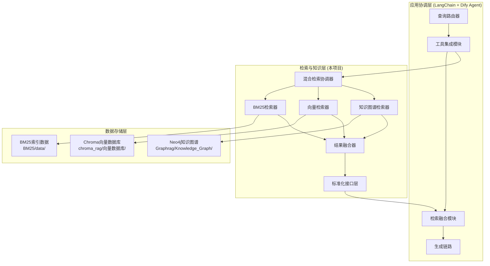
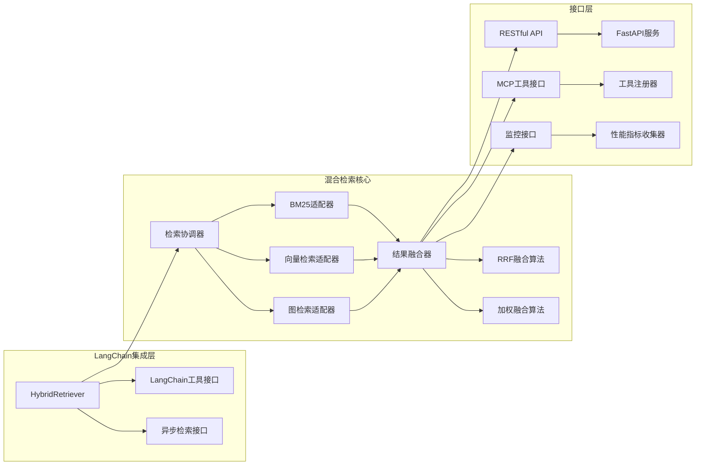

# 混合检索系统集成设计文档

## 概述

本设计文档描述了如何使用LangChain框架整合BM25、向量检索和知识图谱三个独立的检索模块，构建一个统一的混合检索系统。系统将为智能中医问答系统提供全面、准确的知识检索服务，并为上层应用协调层预留标准化接口。

## 架构设计

### 整体架构



### 核心组件架构



## 组件设计

### 1. 混合检索协调器 (HybridRetrievalCoordinator)
**职责**: 协调三个检索模块的并行执行和结果收集

**核心方法**:
```python
class HybridRetrievalCoordinator:
    async def retrieve(self, query: str, retrieval_config: Dict) -> List[RetrievalResult]
    def batch_retrieve(self, queries: List[str]) -> Dict[str, List[RetrievalResult]]
    def get_health_status(self) -> Dict[str, bool]
```

**设计要点**:

支持并行调用三个检索模块
实现超时控制和错误恢复
提供降级策略（某模块失败时继续工作）
支持动态配置检索参数
2. BM25检索适配器 (BM25RetrievalAdapter)
职责: 封装现有BM25高性能搜索引擎，提供标准化接口

核心方法:

class BM25RetrievalAdapter:
    def __init__(self, index_path: str = "BM25/data/optimized_index/optimized_index.pkl.gz")
    async def search(self, query: str, top_k: int = 10) -> List[BM25Result]
    def batch_search(self, queries: List[str]) -> Dict[str, List[BM25Result]]
    def get_statistics(self) -> Dict[str, Any]
数据接口:

加载路径: BM25/data/optimized_index/
索引文件: optimized_index.pkl.gz
医学术语: medical_terms.json
统计信息: optimization_stats.json
3. 向量检索适配器 (VectorRetrievalAdapter)
职责: 封装Chroma向量检索系统，提供语义检索功能

核心方法:

class VectorRetrievalAdapter:
    def __init__(self, persist_directory: str = "chroma_rag/向量数据库/chroma")
    async def search(self, query: str, top_k: int = 10) -> List[VectorResult]
    def similarity_search_with_score(self, query: str) -> List[Tuple[Document, float]]
    def get_database_stats(self) -> Dict[str, Any]
数据接口:

数据库路径: chroma_rag/向量数据库/chroma/
SQLite文件: chroma.sqlite3
向量集合: 87fbcf1b-a960-4ec4-a95f-484bc5bc18a9/
嵌入模型: BAAI/bge-base-zh
4. 知识图谱检索适配器 (GraphRetrievalAdapter)
职责: 封装Neo4j知识图谱，提供实体关系检索功能

核心方法:

class GraphRetrievalAdapter:
    def __init__(self, neo4j_uri: str, dump_path: str = "Graphrag/Knowledge_Graph/neo4j.dump")
    async def entity_search(self, query: str) -> List[EntityResult]
    async def relationship_search(self, entity1: str, entity2: str) -> List[RelationshipResult]
    async def path_search(self, start_entity: str, end_entity: str, max_depth: int = 3) -> List[PathResult]
    def get_graph_statistics(self) -> Dict[str, Any]
数据接口:

图数据库: Neo4j
数据文件: Graphrag/Knowledge_Graph/neo4j.dump
实体类型: HERB, FORMULA, SYMPTOM, DISEASE, ACUPOINT, MERIDIAN, ORGAN, THEORY, METHOD, TECHNIQUE
关系类型: 治疗, 包含, 配伍, 归经, 功效, 主治, 适应症, 禁忌症, 相互作用, 相生/相克
5. 结果融合器 (ResultFusion)
职责: 融合三个检索模块的结果，提供统一的排序结果

融合算法:

RRF (倒数排名融合)
def rrf_fusion(results_list: List[List[Result]], k: int = 60) -> List[FusedResult]:
    """
    RRF算法: score = Σ(1/(k + rank_i))
    """
加权融合
def weighted_fusion(results_list: List[List[Result]], 
                   weights: Dict[str, float]) -> List[FusedResult]:
    """
    加权融合: score = Σ(weight_i * normalized_score_i)
    """
评估指标:

忠实度 (Faithfulness): 结果与原始数据的一致性
相关性 (Relevance): 结果与查询的相关程度
覆盖率 (Coverage): 结果覆盖查询意图的程度
6. LangChain集成层
职责: 提供符合LangChain标准的检索器接口

核心类:

class HybridRetriever(BaseRetriever):
    """LangChain兼容的混合检索器"""
    
    def get_relevant_documents(self, query: str) -> List[Document]
    async def aget_relevant_documents(self, query: str) -> List[Document]
    def batch_get_relevant_documents(self, queries: List[str]) -> List[List[Document]]
工具接口:

class HybridRetrievalTool(BaseTool):
    """LangChain工具接口"""
    
    name = "hybrid_retrieval"
    description = "智能中医混合检索工具，支持关键词、语义和知识图谱检索"
    
    def _run(self, query: str) -> str
    async def _arun(self, query: str) -> str
接口设计
1. RESTful API接口
基础检索接口
POST /api/v1/retrieve
Content-Type: application/json

{
    "query": "感冒发烧怎么治疗",
    "retrieval_config": {
        "enable_bm25": true,
        "enable_vector": true,
        "enable_graph": true,
        "top_k": 10,
        "fusion_method": "rrf"
    }
}
批量检索接口
POST /api/v1/batch_retrieve
Content-Type: application/json

{
    "queries": ["感冒发烧", "咳嗽治疗", "头痛缓解"],
    "retrieval_config": {...}
}
多轮对话检索接口
POST /api/v1/contextual_retrieve
Content-Type: application/json

{
    "query": "那这个方剂的用法用量是什么？",
    "context": [
        {"role": "user", "content": "四君子汤的功效是什么？"},
        {"role": "assistant", "content": "四君子汤具有益气健脾的功效..."}
    ],
    "retrieval_config": {...}
}
2. MCP工具接口
@mcp_tool
def hybrid_retrieval_tool(query: str, 
                         retrieval_type: str = "hybrid",
                         top_k: int = 5) -> Dict[str, Any]:
    """
    MCP兼容的混合检索工具
    
    Args:
        query: 检索查询
        retrieval_type: 检索类型 (bm25|vector|graph|hybrid)
        top_k: 返回结果数量
    
    Returns:
        检索结果字典
    """
3. 监控接口
GET /api/v1/health
GET /api/v1/metrics
GET /api/v1/statistics
数据模型
统一结果格式
@dataclass
class RetrievalResult:
    """统一的检索结果格式"""
    content: str                    # 文档内容
    score: float                   # 相关性评分
    source: str                    # 来源模块 (bm25|vector|graph)
    metadata: Dict[str, Any]       # 元数据
    entities: List[str] = None     # 识别的实体
    relationships: List[str] = None # 相关关系
    
@dataclass
class FusedResult:
    """融合后的结果格式"""
    content: str
    fused_score: float
    source_scores: Dict[str, float]  # 各模块的原始评分
    fusion_method: str               # 融合方法
    metadata: Dict[str, Any]
配置模型
@dataclass
class RetrievalConfig:
    """检索配置"""
    enable_bm25: bool = True
    enable_vector: bool = True
    enable_graph: bool = True
    top_k: int = 10
    fusion_method: str = "rrf"  # rrf|weighted
    weights: Dict[str, float] = None
    timeout: int = 30  # 秒
    
@dataclass
class ModuleConfig:
    """模块配置"""
    bm25_config: Dict[str, Any]
    vector_config: Dict[str, Any]
    graph_config: Dict[str, Any]
错误处理
错误类型定义
class RetrievalError(Exception):
    """检索基础异常"""
    pass

class ModuleUnavailableError(RetrievalError):
    """模块不可用异常"""
    pass

class TimeoutError(RetrievalError):
    """超时异常"""
    pass

class DataSourceError(RetrievalError):
    """数据源异常"""
    pass
降级策略
单模块失败: 继续使用其他可用模块
部分模块失败: 调整融合权重
全部模块失败: 返回错误信息和建议
超时处理: 返回已完成的部分结果
测试策略
单元测试
各适配器的独立功能测试
融合算法的正确性测试
接口兼容性测试
集成测试
端到端检索流程测试
并发性能测试
错误恢复测试
性能测试
响应时间测试 (目标: <2秒)
并发处理测试 (目标: 10个并发)
内存使用测试
准确性评估测试
测试数据
中医问答测试集
多轮对话测试场景
边界条件测试用例
部署架构
本地部署
# docker-compose.yml
version: '3.8'
services:
  hybrid-retrieval:
    build: .
    ports:
      - "8000:8000"
    volumes:
      - ./BM25/data:/app/data/bm25
      - ./chroma_rag/向量数据库:/app/data/chroma
      - ./Graphrag/Knowledge_Graph:/app/data/graph
    environment:
      - NEO4J_URI=bolt://neo4j:7687
  
  neo4j:
    image: neo4j:latest
    ports:
      - "7474:7474"
      - "7687:7687"
    volumes:
      - ./Graphrag/Knowledge_Graph:/var/lib/neo4j/import
云端部署
支持Kubernetes部署
支持Docker Swarm部署
支持无服务器部署 (AWS Lambda/Azure Functions)
监控和日志
性能监控
响应时间监控
吞吐量监控
错误率监控
资源使用监控
业务监控
检索质量监控
用户查询分析
热点内容分析
日志策略
结构化日志 (JSON格式)
分级日志 (DEBUG/INFO/WARN/ERROR)
日志轮转和归档
敏感信息脱敏
安全考虑
数据安全
数据传输加密 (HTTPS/TLS)
数据存储加密
访问控制和认证
审计日志
接口安全
API密钥认证
请求频率限制
输入验证和过滤
SQL注入防护
扩展性设计
水平扩展
支持多实例部署
负载均衡配置
数据分片策略
功能扩展
插件式架构支持新检索模块
配置热重载
动态算法切换
A/B测试支持
配置管理
配置文件结构
# config/hybrid_retrieval.yaml
retrieval:
  modules:
    bm25:
      enabled: true
      index_path: "BM25/data/optimized_index/optimized_index.pkl.gz"
      timeout: 10
    vector:
      enabled: true
      persist_directory: "chroma_rag/向量数据库/chroma"
      model_path: "BAAI/bge-base-zh"
      timeout: 15
    graph:
      enabled: true
      neo4j_uri: "bolt://localhost:7687"
      dump_path: "Graphrag/Knowledge_Graph/neo4j.dump"
      timeout: 20
  
  fusion:
    default_method: "rrf"
    rrf_k: 60
    weights:
      bm25: 0.4
      vector: 0.4
      graph: 0.2
  
  api:
    host: "0.0.0.0"
    port: 8000
    workers: 4
    
  monitoring:
    enable_metrics: true
    log_level: "INFO"
    performance_tracking: true
环境变量支持
# 数据路径配置
HYBRID_RETRIEVAL_BM25_PATH=/path/to/bm25/data
HYBRID_RETRIEVAL_CHROMA_PATH=/path/to/chroma/db
HYBRID_RETRIEVAL_GRAPH_PATH=/path/to/graph/data

# 服务配置
HYBRID_RETRIEVAL_HOST=0.0.0.0
HYBRID_RETRIEVAL_PORT=8000
HYBRID_RETRIEVAL_WORKERS=4

# Neo4j配置
NEO4J_URI=bolt://localhost:7687
NEO4J_USER=neo4j
NEO4J_PASSWORD=password