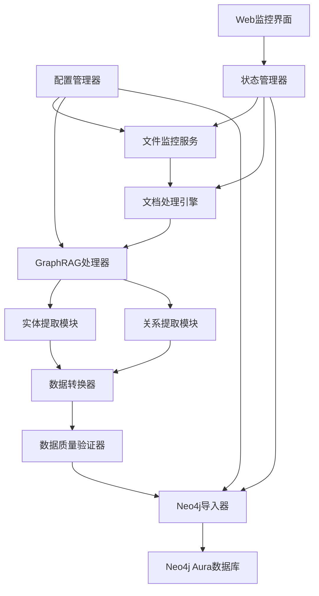

# Design Document

## Overview

本设计文档描述了一个自动化的Graph+知识图谱处理系统，该系统基于现有的GraphRAG项目，能够自动监控输入文件夹，提取文档中的实体和关系信息，生成Neo4j兼容的数据格式，并自动导入到知识图谱数据库中。

系统采用模块化设计，包含文件监控、文档处理、实体提取、关系分析、数据转换、质量验证和数据库导入等核心模块。

## Architecture

### 系统架构图



### 核心组件

1. **文件监控服务 (File Watcher Service)**
   - 监控input文件夹的文件变化
   - 支持多种文档格式（txt, md, pdf, docx）
   - 文件处理状态管理

2. **文档处理引擎 (Document Processing Engine)**
   - 文档格式转换和预处理
   - 文本清理和标准化
   - 编码处理（特别是中文支持）

3. **GraphRAG处理器 (GraphRAG Processor)**
   - 集成现有的GraphRAG功能
   - 实体和关系提取
   - 社区检测和图分析

4. **数据转换器 (Data Converter)**
   - 将GraphRAG输出转换为Neo4j格式
   - CSV文件生成（entities.csv, relationships.csv）
   - 数据格式验证

5. **Neo4j导入器 (Neo4j Importer)**
   - 连接Neo4j Aura数据库
   - 批量数据导入
   - 导入状态监控和错误处理

## Components and Interfaces

### 1. 文件监控服务 (FileWatcherService)

```python
class FileWatcherService:
    def __init__(self, config: Config):
        self.input_dir = config.input_directory
        self.processed_dir = config.processed_directory
        self.supported_formats = ['.txt', '.md', '.pdf', '.docx']
    
    def start_monitoring(self) -> None:
        """开始监控文件夹"""
        
    def on_file_added(self, file_path: str) -> None:
        """处理新增文件"""
        
    def move_to_processed(self, file_path: str) -> None:
        """移动已处理文件"""
```

### 2. 文档处理引擎 (DocumentProcessor)

```python
class DocumentProcessor:
    def process_document(self, file_path: str) -> ProcessedDocument:
        """处理文档并返回标准化文本"""
        
    def extract_text_from_pdf(self, file_path: str) -> str:
        """从PDF提取文本"""
        
    def extract_text_from_docx(self, file_path: str) -> str:
        """从Word文档提取文本"""
        
    def clean_and_normalize(self, text: str) -> str:
        """清理和标准化文本"""
```

### 3. GraphRAG处理器 (GraphRAGProcessor)

```python
class GraphRAGProcessor:
    def __init__(self, config: GraphRAGConfig):
        self.llm_config = config.llm
        self.embedding_config = config.embeddings
        
    def extract_entities_and_relationships(self, document: ProcessedDocument) -> GraphRAGResult:
        """提取实体和关系"""
        
    def run_entity_extraction(self, text: str) -> List[Entity]:
        """运行实体提取"""
        
    def run_relationship_extraction(self, text: str, entities: List[Entity]) -> List[Relationship]:
        """运行关系提取"""
```

### 4. 数据转换器 (DataConverter)

```python
class DataConverter:
    def convert_to_neo4j_format(self, graphrag_result: GraphRAGResult) -> Neo4jData:
        """转换为Neo4j格式"""
        
    def generate_entities_csv(self, entities: List[Entity]) -> str:
        """生成实体CSV文件"""
        
    def generate_relationships_csv(self, relationships: List[Relationship]) -> str:
        """生成关系CSV文件"""
        
    def ensure_id_consistency(self, entities: List[Entity], relationships: List[Relationship]) -> None:
        """确保ID一致性"""
```

### 5. Neo4j导入器 (Neo4jImporter)

```python
class Neo4jImporter:
    def __init__(self, config: Neo4jConfig):
        self.uri = config.uri
        self.username = config.username
        self.password = config.password
        
    def import_data(self, entities_csv: str, relationships_csv: str) -> ImportResult:
        """导入数据到Neo4j"""
        
    def import_entities(self, entities_csv: str) -> None:
        """导入实体数据"""
        
    def import_relationships(self, relationships_csv: str) -> None:
        """导入关系数据"""
        
    def validate_import(self) -> ValidationResult:
        """验证导入结果"""
```

## Data Models

### 核心数据模型

```python
@dataclass
class ProcessedDocument:
    """处理后的文档"""
    id: str
    title: str
    content: str
    file_path: str
    processed_at: datetime
    metadata: Dict[str, Any]

@dataclass
class Entity:
    """实体模型"""
    id: str
    name: str
    type: str  # PERSON, ORGANIZATION, GEO, EVENT, etc.
    description: str
    confidence: float
    source_document: str
    
@dataclass
class Relationship:
    """关系模型"""
    id: str
    source_entity_id: str
    target_entity_id: str
    relationship_type: str
    description: str
    weight: float
    confidence: float
    source_document: str

@dataclass
class Neo4jData:
    """Neo4j导入数据"""
    entities_csv_path: str
    relationships_csv_path: str
    entity_count: int
    relationship_count: int
```

### 配置模型

```python
@dataclass
class SystemConfig:
    """系统配置"""
    input_directory: str = "input"
    processed_directory: str = "processed"
    output_directory: str = "output"
    neo4j: Neo4jConfig
    graphrag: GraphRAGConfig
    monitoring: MonitoringConfig

@dataclass
class Neo4jConfig:
    """Neo4j配置"""
    uri: str = "neo4j+s://8b3f1af4.databases.neo4j.io"
    username: str = "8b3f1af4"
    password: str = "k6HxNzfy-bG84a8bHZTKyXm7OYCDw1zW4mGqWPJHCaQ"
    database: str = "8b3f1af4"
    batch_size: int = 1000
```

## Error Handling

### 错误处理策略

1. **文件处理错误**
   - 不支持的文件格式：记录警告，跳过处理
   - 文件损坏：移动到error文件夹，记录错误日志
   - 权限问题：重试机制，最终失败则通知管理员

2. **GraphRAG处理错误**
   - API调用失败：指数退避重试
   - 内存不足：分块处理大文档
   - 提取结果为空：记录警告，生成空结果文件

3. **数据转换错误**
   - ID冲突：自动生成新ID并记录映射
   - 数据格式错误：数据清理和修复
   - CSV生成失败：回滚并重新生成

4. **Neo4j导入错误**
   - 连接失败：重试机制，失败后发送通知
   - 数据约束违反：清理数据后重新导入
   - 部分导入失败：回滚事务，记录详细错误

### 错误恢复机制

```python
class ErrorHandler:
    def handle_file_error(self, error: Exception, file_path: str) -> None:
        """处理文件相关错误"""
        
    def handle_processing_error(self, error: Exception, document: ProcessedDocument) -> None:
        """处理文档处理错误"""
        
    def handle_import_error(self, error: Exception, data: Neo4jData) -> None:
        """处理导入错误"""
        
    def retry_with_backoff(self, func: Callable, max_retries: int = 3) -> Any:
        """指数退避重试机制"""
```

## Testing Strategy

### 测试层次

1. **单元测试**
   - 每个组件的核心功能测试
   - 数据转换逻辑测试
   - 错误处理测试

2. **集成测试**
   - GraphRAG处理流程测试
   - Neo4j连接和导入测试
   - 端到端数据流测试

3. **性能测试**
   - 大文件处理性能
   - 批量导入性能
   - 内存使用测试

4. **数据质量测试**
   - 实体提取准确性
   - 关系识别准确性
   - 数据完整性验证

### 测试数据

```python
class TestDataGenerator:
    def generate_test_documents(self) -> List[str]:
        """生成测试文档"""
        
    def generate_expected_entities(self) -> List[Entity]:
        """生成预期实体结果"""
        
    def generate_expected_relationships(self) -> List[Relationship]:
        """生成预期关系结果"""
```

### 测试环境

- **开发环境**: 使用本地Neo4j实例
- **测试环境**: 使用Docker容器化的Neo4j
- **生产环境**: 使用Neo4j Aura实例

## Performance Considerations

### 性能优化策略

1. **并行处理**
   - 多线程文件监控
   - 异步文档处理
   - 并行实体提取

2. **内存管理**
   - 流式处理大文档
   - 分批处理实体和关系
   - 及时释放临时数据

3. **数据库优化**
   - 批量导入操作
   - 索引优化
   - 连接池管理

4. **缓存策略**
   - 处理结果缓存
   - 实体去重缓存
   - 配置缓存

### 监控指标

```python
class PerformanceMonitor:
    def track_processing_time(self, document_size: int, processing_time: float) -> None:
        """跟踪处理时间"""
        
    def track_memory_usage(self) -> None:
        """跟踪内存使用"""
        
    def track_import_performance(self, record_count: int, import_time: float) -> None:
        """跟踪导入性能"""
```

## Security Considerations

### 安全措施

1. **数据库安全**
   - 加密连接（Neo4j+s协议）
   - 凭据安全存储
   - 访问权限控制

2. **文件安全**
   - 文件类型验证
   - 路径遍历防护
   - 文件大小限制

3. **API安全**
   - GraphRAG API密钥管理
   - 请求频率限制
   - 错误信息脱敏

### 配置安全

```python
class SecurityConfig:
    max_file_size: int = 100 * 1024 * 1024  # 100MB
    allowed_file_types: List[str] = ['.txt', '.md', '.pdf', '.docx']
    api_rate_limit: int = 100  # requests per minute
    
    def validate_file(self, file_path: str) -> bool:
        """验证文件安全性"""
```